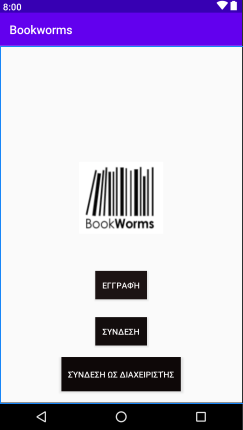
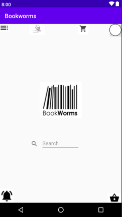
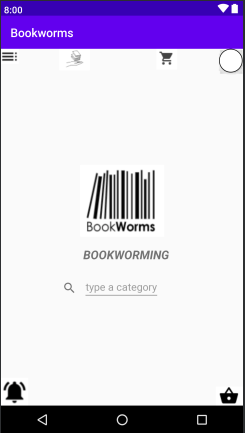
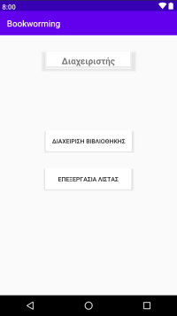
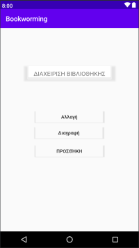
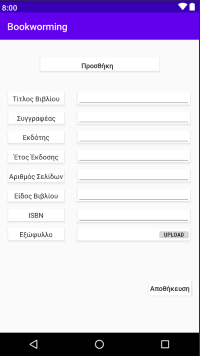
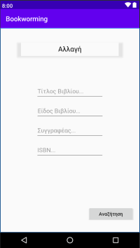

## Bookworming

This is a **Library Mobile System** that User can
  - search books
  - be informed about the availability of books around his/her city's Libraries
  - reserve, buy or borrow books
  - review his/her books
  - take knowledge quiz about differents categories of books
  - choose to suggest him/her the best book by top rated reviews in this category.
  
Also we have also implemented an Interface for Admin where can
 - manage books (add/ edit/ delete)
 - manage Book Lists (=same category books)
 

### UI

* Some of UIs that implemented on Android Studio is here:

* You can check our prototype virtual application [here](https://www.figma.com/proto/BLNJzArXshZJ9vYTSCEAxp/BookWorms?node-id=192%3A2&scaling=scale-down)

# -------------------------------- #

#### Team
Names                 | Email
--------------------- | ---------------------
Spiros Karathanassis  | karathanassis13@gmail.com
Giorgos Tzelepis      | geo335127@gmail.com
Stella Markopoulou    | stmarkop@gmail.com
Niki Georgiou         | georgioynikh@gmail.com
Dimitra Poulaki       | dimitrampoulaki@gmail.com
